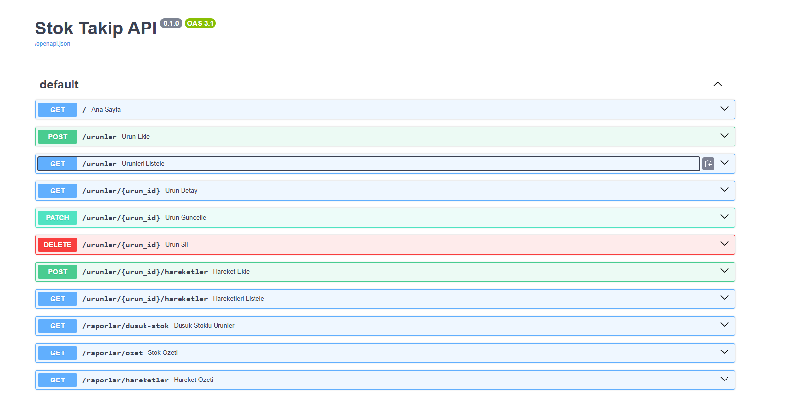

# Stok Takip API

Küçük işletmeler için ürün, stok hareketi ve raporlama yönetimi sağlayan REST API.
FastAPI ve SQLAlchemy ile geliştirilmiştir.

## Özellikler

- Ürün ekleme, listeleme, kategoriye göre filtreleme, güncelleme ve silme
- Stok giriş/çıkış işlemleri; yetersiz stokta çıkış engellenir
- Her stok değişikliği hareket kaydı olarak tutulur (geriye dönük izlenebilirlik)
- Minimum stok seviyesine göre düşük stok uyarısı
- Stok değeri ve dönemsel giriş/çıkış raporları (SQL toplama sorguları)
- Pydantic ile girdi doğrulama, otomatik Swagger dokümantasyonu

## Kullanılan Teknolojiler

Python · FastAPI · SQLAlchemy 2.0 · SQLite · Pydantic v2 · Uvicorn

## Kurulum

```bash
git clone https://github.com/metinpiral/stok-takip-api.git
cd stok-takip-api
python -m venv venv
venv\Scripts\activate        # Linux/Mac: source venv/bin/activate
pip install -r requirements.txt
python -m uvicorn main:app --reload
```

API dokümantasyonu: http://127.0.0.1:8000/docs

## Endpoint'ler

| Metot | Yol | Açıklama |
|-------|-----|----------|
| POST | `/urunler` | Yeni ürün ekler |
| GET | `/urunler` | Ürünleri listeler (`kategori=` ile filtre) |
| GET | `/urunler/{id}` | Ürün detayı |
| PATCH | `/urunler/{id}` | Ürün bilgilerini günceller |
| DELETE | `/urunler/{id}` | Ürünü siler |
| POST | `/urunler/{id}/hareketler` | Stok girişi / çıkışı |
| GET | `/urunler/{id}/hareketler` | Ürünün hareket geçmişi |
| GET | `/raporlar/dusuk-stok` | Minimum seviyenin altındaki ürünler |
| GET | `/raporlar/ozet` | Toplam ürün, adet ve stok değeri |
| GET | `/raporlar/hareketler` | Son X günün giriş/çıkış özeti (`gun=30`) |

## Tasarım Kararları

- **Stok doğrudan güncellenemez.** Miktar yalnızca giriş/çıkış hareketleriyle değişir, böylece her değişikliğin kaydı tutulur.
- **Stok güncellemesi ve hareket kaydı tek işlemde (transaction) yapılır.** Biri kaydedilip diğerinin kaydedilmemesi mümkün değildir.
- **Raporlar veritabanında hesaplanır.** `SUM`, `CASE`, `GROUP BY` kullanılarak veriler Python'a çekilmeden özetlenir.

